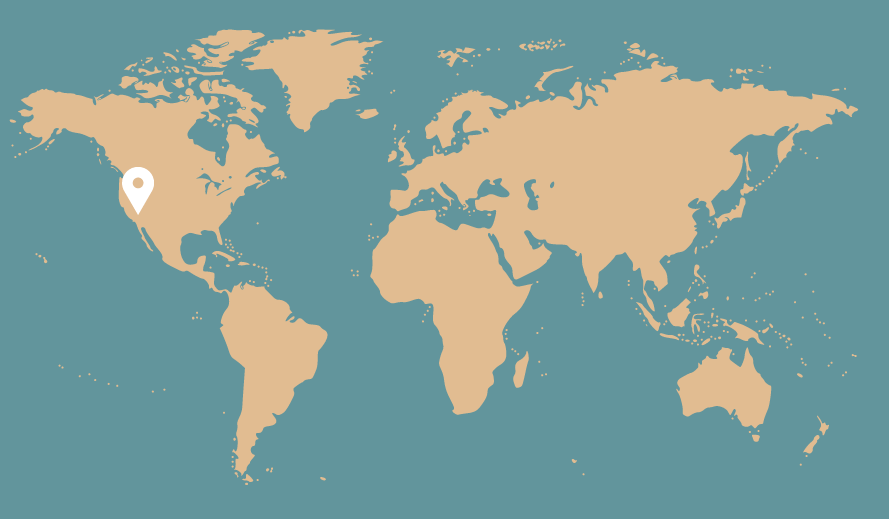
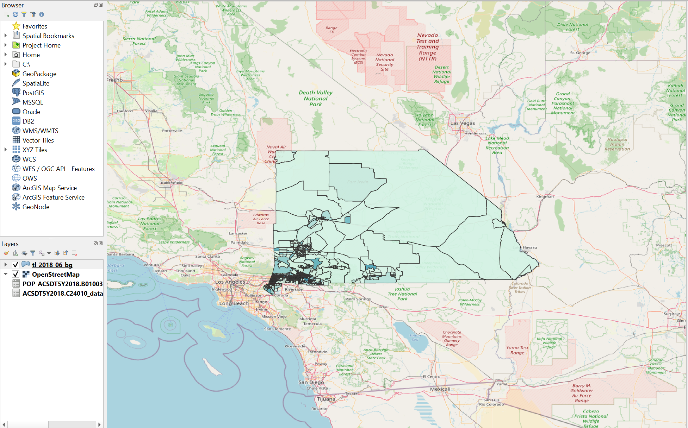

 

  

  <h2 align="center"></h2>
  <h3 align="center">San Bernardino County Women in Stem Map Visualization</h4>

  

    Visualization tool to display the percentages of women in San Bernardino County, California with occupations in Science, Engineering, or Technology. Data obtained from the U.S. Census, and displayed with minor python scripting in QGIS.
     
     
    <a href="https://github.com/MelissaAppel/QGIS_WOMEN_IN_STEM_SB"><strong>Explore the docs »</strong></a>
     
     <a href="https://melissaappel.com/sboccupations.html#7/34.537/-115.833"><strong>See the map »</strong></a>
      
  

<!-- TABLE OF CONTENTS -->

  
Table of Contents

  <ol>
    <li>
      <a href="#about-the-project">About The Project</a>
      <ul>
        <li><a href="#built-with">Built With</a></li>
      </ul>
    </li>
    <li><a href="#usage">Map</a></li>
  </ol>

<!-- ABOUT THE PROJECT -->
## About The Project
Interactive map built with QGIS to display the percentage of women in San Bernardino County with occupations in STEM, as derived from the 2018 U.S. Census. 
 
Map highlights entire San Bernardino County region, and divides county in block groups. Block groups with darker pigmentation represent higher percentage of women with occupations in STEM than areas with lower pigmentation. 
 
Inspection of the map will show that regions closer to San Bernardino, and Riverside have the highest percentage of women employed in the STEM field. 

### Built With

* [QGIS](https://www.qgis.org/en/site/)
* [U.S. Census](https://www.census.gov/data/tables.html)

<!-- USAGE EXAMPLES -->
## Screenshots from App

